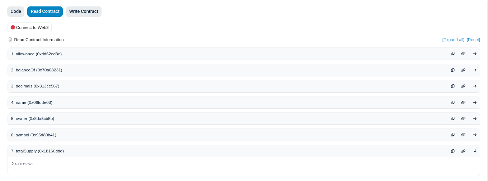

# Déploiement

Pour que le déployement soit possible, il est nécessaire :
- de créer un compte alchemy et de récupérer la clé api pour la renseigner dans la variable `ALCHEMY_APU_KEY` du `.env`
- de créer un compte etherscan et de récupérer la clé api pour la renseigner dans la variable `ETHERSCAN_API_KEY` du `.env`

## Variables d'environnement nécessaires

- ALCHEMY_API_KEY=clé_api_sur_alchemy
- PRIVATE_KEY=clé_privée_compte_wallet_sur_metamask
- PRIVATE_KEY_MULTISIG=clé_privée_second_compte_wallet_sur_metamask
- ETHERSCAN_API_KEY=clé_api_sur_etherscan

## COMM42

https://hardhat.org/ignition/docs/getting-started

1. Pour commencer mettre à jour les dépendances nécessaires avec la commande `npm install`
3. Lancer la commande `npx hardhat ignition deploy ./deployment/ignition/modules/Community42.ts --network sepolia`

## MultiSig

Dans un terminal lancer la commande `npx hardhat ignition deploy ./deployment/ignition/modules/MultiSig.ts --network sepolia`

# Tests

## Lancer les tests unitaires sur hardhat

Lancer la commande `npx hardhat test`

## Tester sur Etherscan avec Metamask 

Pour tester correctement l'utilisation du token, il est nécessaire d'installer l'extension Metamask sur le navigateur de votre choix, de créer un portefeuille avec un ou plusieurs comptes ayant de la monnaie de test Sepolia ETH ([cliquer ici pour en récupérer](https://cloud.google.com/application/web3/faucet/ethereum/sepolia)).

1. Lancer la commande `npx hardhat verify --network sepolia <adresse-du-contrat>`

2. Coller le lien dans un navigateur

3. Cliquer sur `Connect to Web3` et tester les méthodes

4. Ajouter (sepolia)[https://www.datawallet.com/fr/crypto/ajouter-sepolia-%C3%A0-metamask] et COMM42 dans Metamask

5. Tester les méthodes

Exemple signup:

Exemple create and participate in event:

- Encoder le nom de l'evenement

- Créer l'evenement sur le token

- Participer à l'evenement avec un autre compte

- Confirmer la transaction

- L'adresse qui s'est inscrite à l'evenement a donné 2 COMM42.

- L'adresse qui a organisé l'evenement a recu 2 COMM42.

### Tester la multi-signature

1. Lancer la commande `npx hardhat verify --network sepolia <contract-address>`

2. Aller sur le contrat COMM42, se connecter avec l'adresse de celui qui a déployer le contrat COMM42 (regarder le `owner` du contrat pour savoir).

3. Dans `Write Contract`, donner les droits `transferOwnership` à l'adresse du contrat MultiSig.

 
4. Faire une demande via la multi-signature

Exemple: 

- Faire une demande de `mint` sur l'adresse du contrat de COMM42 avec un compte owner

- Verifier que la demande a été prise en compte avec une première signature

- Valider la demande avec un autre compte owner

- Vérifier que le compte a bien recu le transfert et que le totalSupply a augmenté également sur le contrat COMM42

