# Deployment

To enable deployment, you must:
- Create an Alchemy account and retrieve the API key to set it in the `ALCHEMY_APU_KEY` variable in the `.env` file
- Create an Etherscan account and retrieve the API key to set it in the `ETHERSCAN_API_KEY` variable in the `.env` file

## Required environment variables

- ALCHEMY_API_KEY=API_key_on_alchemy
- PRIVATE_KEY=private_key_for_wallet_account_on_metaMask
- PRIVATE_KEY_MULTISIG=private_key_for_second_wallet_account_on_metamask
- ETHERSCAN_API_KEY=API_key_on_etherscan

# COMM42

https://hardhat.org/ignition/docs/getting-started

1. First, update the necessary dependencies using the `npm install` command
2. Run the `npx hardhat ignition deploy ./deployment/ignition/modules/Community42.ts --network sepolia` command

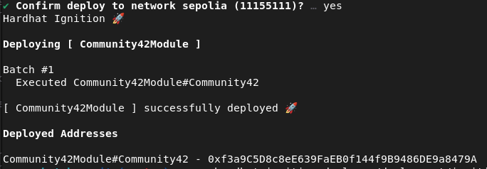

## MultiSig

In a terminal, run the command `npx hardhat ignition deploy ./deployment/ignition/modules/MultiSig.ts --network sepolia`

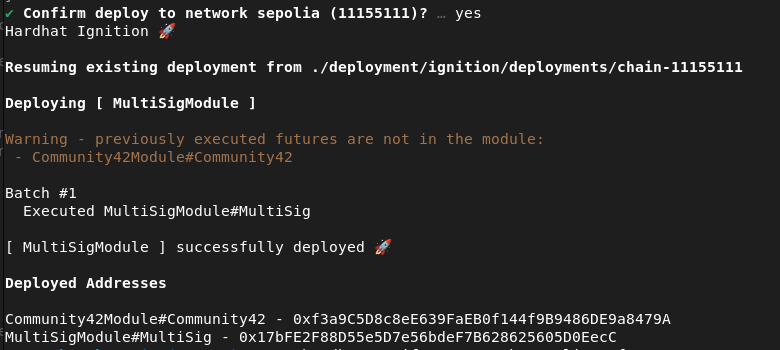

# Tests

## Run unit tests on Hardhat

Run the command `npx hardhat test`

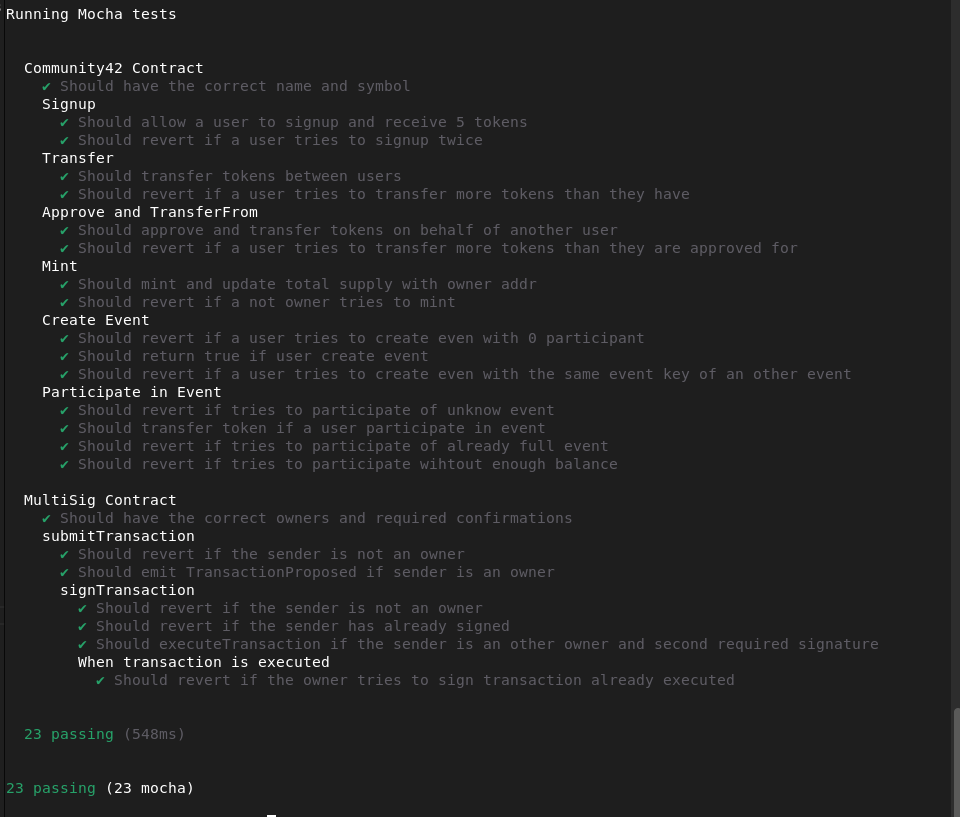

## Test on Etherscan with Metamask 

To properly test the token, you need to install the Metamask extension on your preferred browser and create a wallet with one or more accounts containing Sepolia ETH test currency ([click here to get some](https://cloud.google.com/application/web3/faucet/ethereum/sepolia)).

1. Run the command `npx hardhat verify --network sepolia <contract-address>`

2. Paste the link into a browser

3. Click `Connect to Web3` and test the methods

4. Add (sepolia)[https://www.datawallet.com/fr/crypto/ajouter-sepolia-%C3%A0-metamask] and COMM42 to Metamask

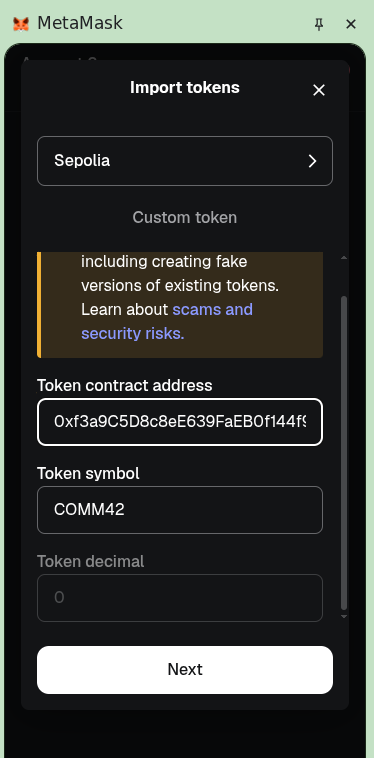

5. Test the methods

signup example:

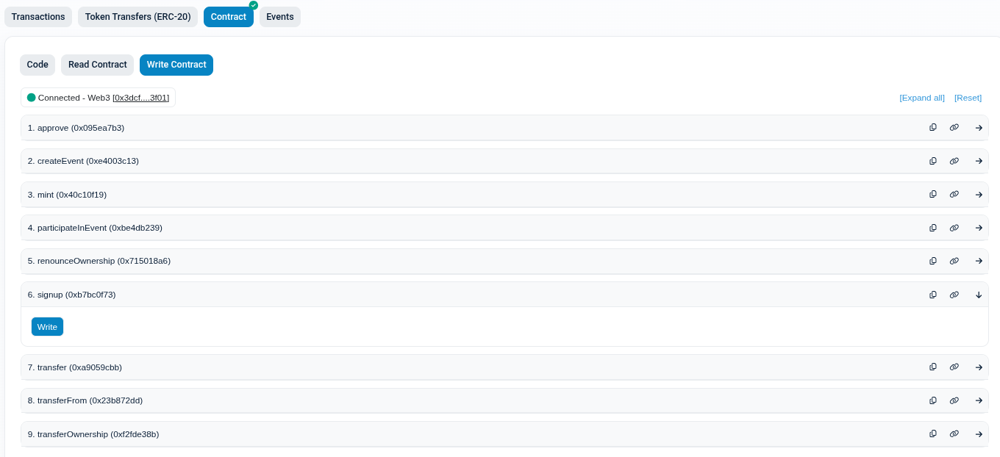
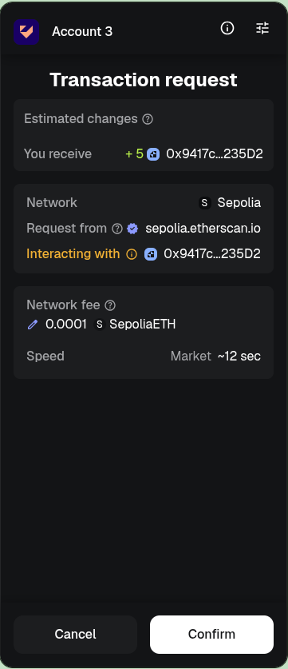
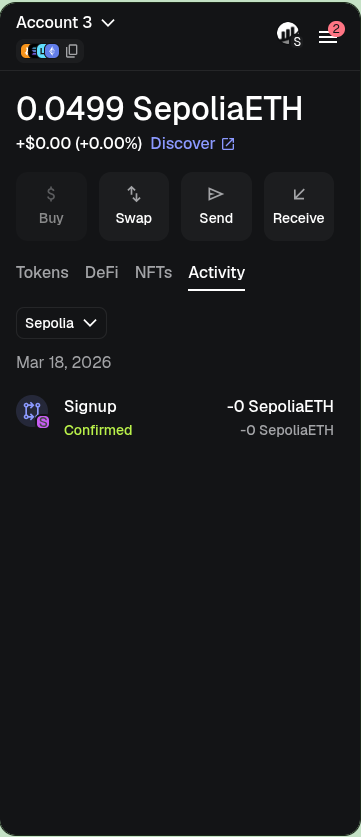
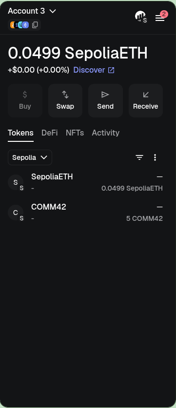

Create and participate in event example:

- Hash in bytes32 the event name
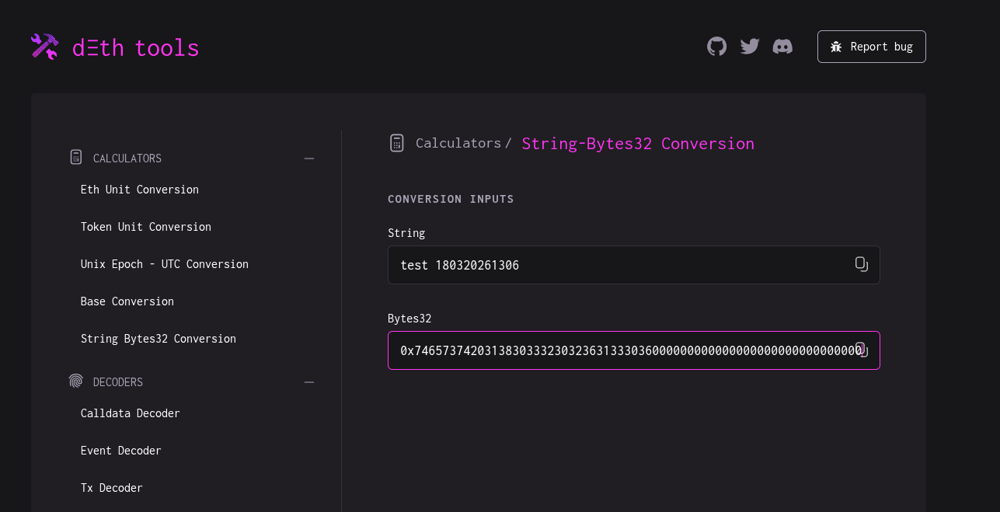

- Create the event on the token
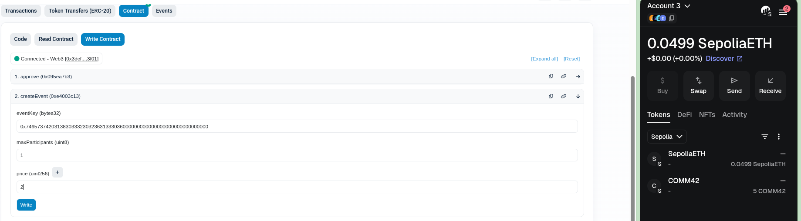

- Participate in the event with an other account
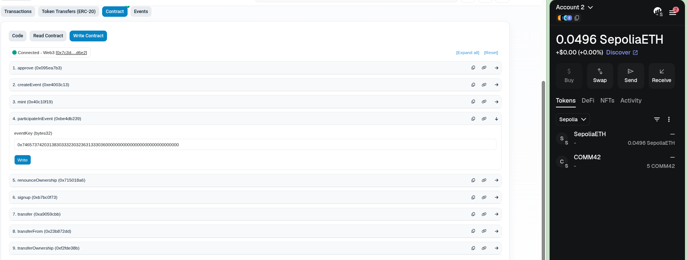

- Confirm transaction
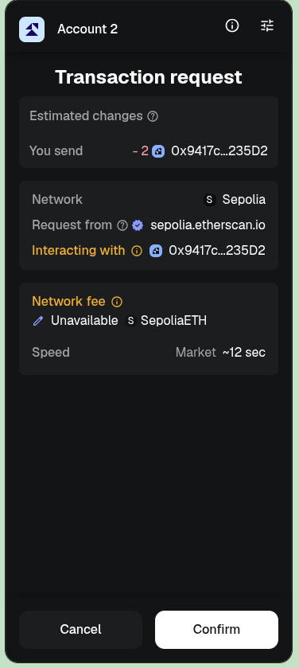

- The email address that participate for the event returned 2 COMM42.

- The address that create the event received 2 COMM42s.
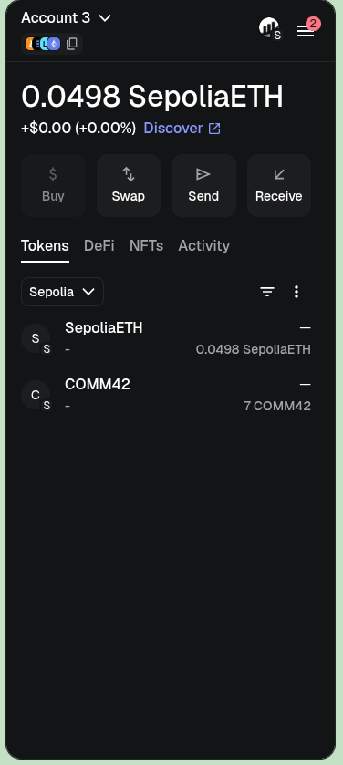

### Testing multi-signature

1. Run the command `npx hardhat verify --network sepolia <contract-address>`

2. Go to the COMM42 contract and log in using the email address of the person who deployed the COMM42 contract.

3. In `Write Contract`, grant the `transferOwnership` permission to the multisignature contract address.

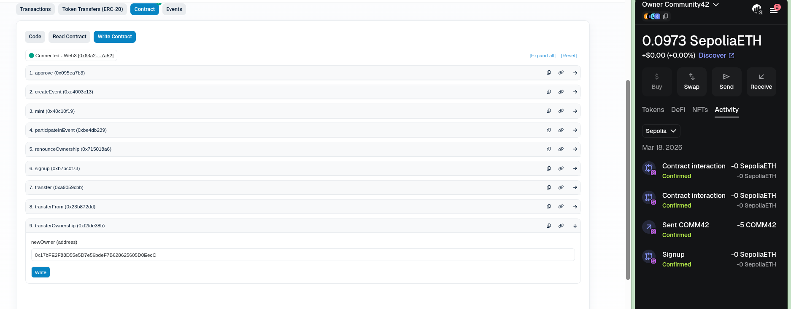
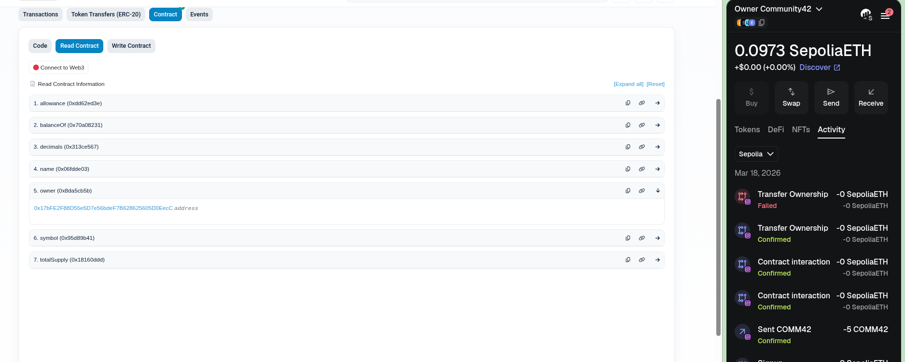
 
4. Submit a request via multi-signature

Example: 

- Request `mint` using the COMM42 contract address with an owner account
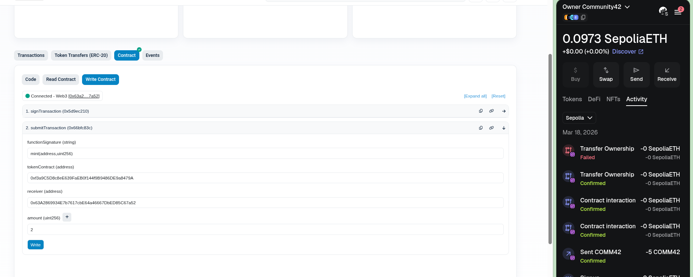

- Verify that the request has been acknowledged with an initial signature
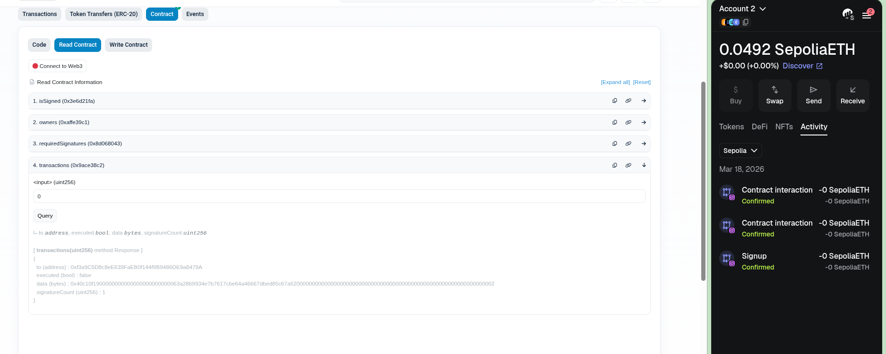

- Approve the request using another owner account
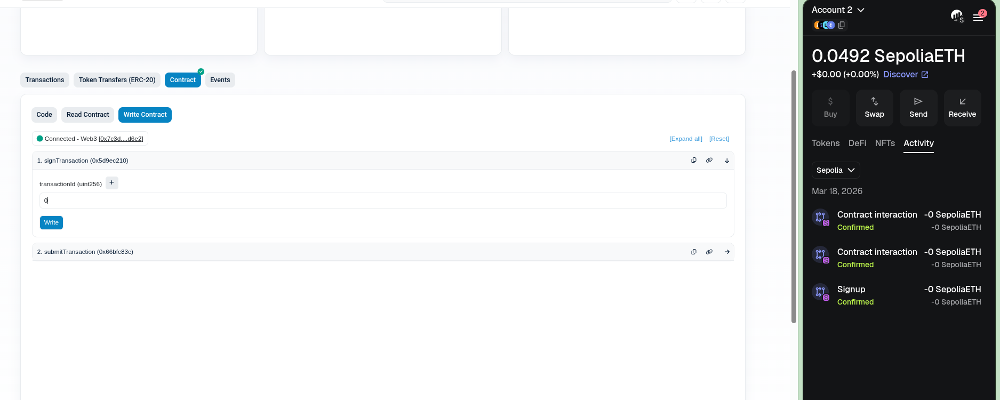

- Verify that the account has received the transfer and that the totalSupply has also increased on the COMM42 contract
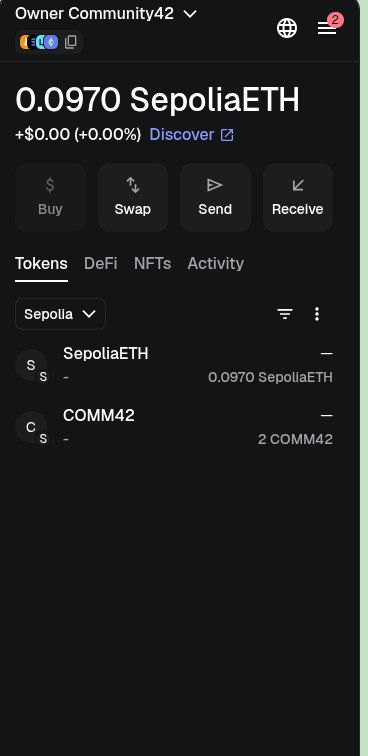

